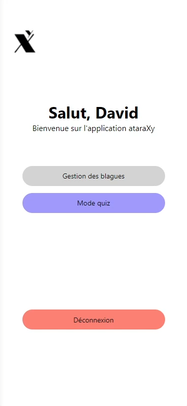
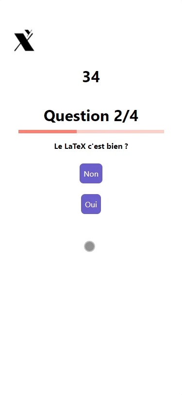

This post is still in building !

[Source code](https://github.com/strawhattom/ataraXy)

## Context
This project was made during my intership for the end of my computer science degree at **Université Sorbonne Paris Nord** (Villetaneuse, France). The aim was to create a mobile app where students could use it to answer prepared quiz by an organizer (most likely a teacher).
\
The management of these quizzes were also have to be made, since the client was my supervisor, i had to create a new page on his website (in **PHP**).

## Preview

## Functionnalities implemented
### Web
- Create/Edit/Delete quiz
- Add/update/remove questions in a quiz
- View quiz state (current question, how many points it gives, time left...)
### Mobile
- Login/register
- Do a quiz