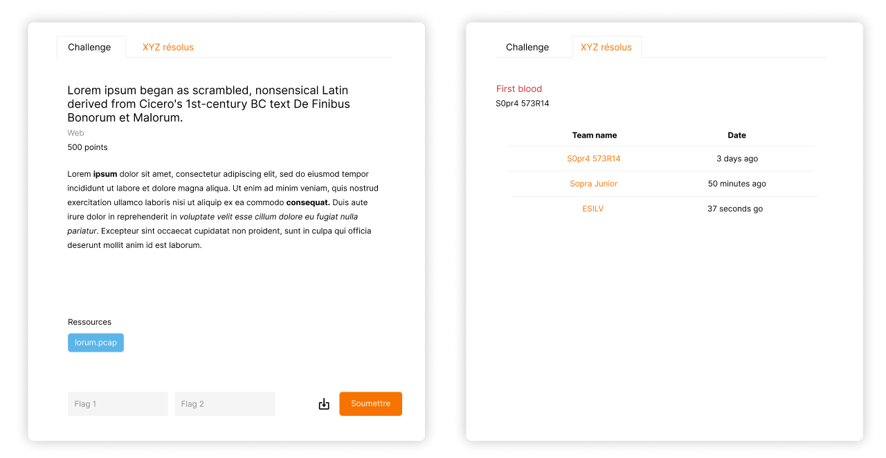

This project is still in pending

## Context

During my 2nd year of engineering and majoring in Cybersecurity & Cloud Computing, we had the opportunity to participate to a tutored project in a team of 4 or 5 with a company in order to develop our professional experience and to develop our skills. \
This web application was intended to create a code battle platform within Sopra Steria, the purpose was to create a platform where interns or externs could participate and complete challenges in order to gain point and to win a battle. \
 
## Conception

The function of the platform were easy to understand, we have multiple challenges in an active battle and participants (in a team) have to submit their solutions to obtain points, a leaderboard is available if people want to check their positions. \
Multiple roles are defined, admins, judges and participants:
- Admins: organizer, the ones who create challenges and decide when the battle will be up.
- Judges: they are part of a team, they have access to challenges' solutions in order to help their dedicated team if they have struggle in a challenge.
- Participants: they can register on the platform to participate to challenges, challenges are shown only if a battle is active and if the challenge is in the battle.

It look like multiple battle platform that already exists, like CTF's, CodinGame or Google's Code Competition.

## Sketches

### Login page

### Challenge popup

## Functionnalities implemented

