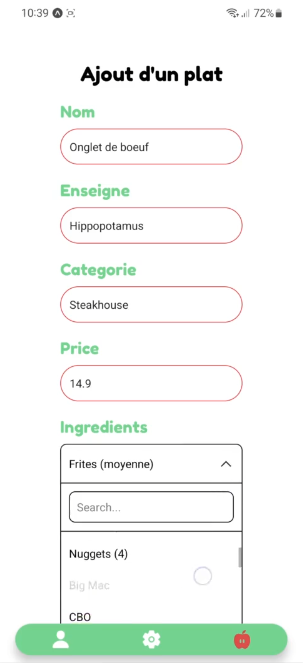

This post is still in building !

## Context

This project debuted in september 2021 for our third year in engineering, it was a team project (**PING**, **P**rojet d'**I**ngénieur **N**umérique **G**énéraliste in french) from 4 to 5 members and we had the opportunity to make a project on any subject. The purpose was to learn to build a business plan, lean canvas and finally gain skills.
\
We decided to create **a mobile application** to make it available everywhere and also to track students consumptions and expenses according to their goals before or after eating it.
\
Our team was composed of 5 members, 3 (including me) from a 2 year degree of computer science and 2 other from prepatory classes. Therefore we were a diverse team.

[Source code](https://github.com/steven-van/FollowMeal)

## Preview

## Management

To manage our team, member's roles, we discussed about our strength and weaknesses, we finally split up the team with 3 technical persons and 2 theorical persons. \

For me, i was a technical person because i have created a mobile app before (during an intership) and it was the best for me to be among this team. The technical team had to choose technologies and conceptualize the app. The theorical team had to analyze students' situation and search a math formula to give a note to a user from his goals, consumptions and expenses.

## Outcome

...