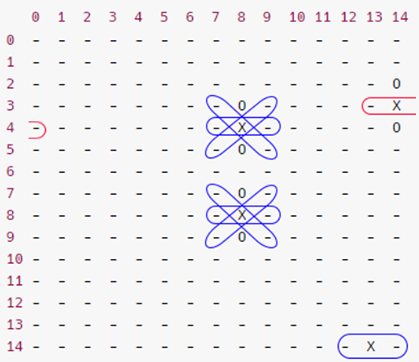
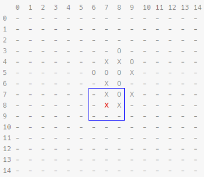

[Source code](https://github.com/nami10/GomoTUX2)

## Context

In the second semester of my first year in engineering we had an introduction to IA and this project was done to train to apply minimax algorithm with special heuristics. \
**Gomoku** is a 15x15 board game with 2 colored pieces (black & white), to win a game, you have to align 5 pieces of your color (whether black or white) in any directions (horizontal, vertical, diagonal).

## Why in C++ ?

We decided to implement the algorithm in **C++** because it is 400 times faster than python (the main language used for data analysis and IA during our semester). \
*Source : [is-python-faster-and-lighter-than-c](https://stackoverflow.com/questions/801657/is-python-faster-and-lighter-than-c)*

## The board

### Using bitboards

Using a bitboard (0 or 1) may be interesting for the implementation of our game, we decided to give it a try to see how this way of thinking would go. \
With this board each player (`board1` & `board2`) would have his own board and the final board would be a bitwise `or` operator : `board1` | `board2`.

in code :

```cpp
//game.hpp
#include <bitset>
// 225 because the board is 15*15
bitset<225> board1; // board of the first player
bitset<225> board2; // board of the second player

//board.hpp
bitset<225> board = board1 | board2;
```

As long as we go the development will be more complex so we changed the board type

### Char matrix

We went for a matrix of `char` because the board's optimization is not very important rather than our minimax algorithm, we could change easily our board, we needed to focus on our heuristic.

```cpp
// game.hpp
char **board;

// board.hpp
board = new char[15][15];
```


### Char array (final decision)

By looking into existing Gomoku's IA competitions, we saw that everyone used a 1D array. It was logic because a matrix is heavier in memory than a simple `char` pointer.

```cpp
// game.hpp
char *board;

// board.hpp
board = new char[225];
```


## Heuristic

### Regex pattern

Transforming our board into a string we could notice repeating patterns, which can be used to evaluate a state of our board.

**NB :**
- line pattern `-` : each 15 chars, we get our pattern (1 or more)
- column `|` : each char of the pattern has 14 'non-greedy' (`*`) chars in-between
- diagonal `\` : each char of the pattern has 15 'non-greedy' (`*`) chars in-between
- diagonal `/` : each char of the pattern has 13 'non-greedy' (`*`) chars in-between

Example with `-X-` pattern: 

```bash
   0  1  2  3  4  5  6  7  8  9  10 11 12 13 14 
0  -  -  -  -  -  -  -  -  -  -  -  -  -  -  -
1  -  -  -  -  -  -  -  -  -  -  -  -  -  -  -
2  -  -  -  -  -  -  -  -  -  -  -  -  -  -  O
3  -  -  -  -  -  -  -  -  O  -  -  -  -  -  X
4  -  -  -  -  -  -  -  -  X  -  -  -  -  -  O  
5  -  -  -  -  -  -  -  -  O  -  -  -  -  -  -
6  -  -  -  -  -  -  -  -  -  -  -  -  -  -  -  
7  -  -  -  -  -  -  -  -  O  -  -  -  -  -  -
8  -  -  -  -  -  -  -  -  X  -  -  -  -  -  -  
9  -  -  -  -  -  -  -  -  O  -  -  -  -  -  -
10 -  -  -  -  -  -  -  -  -  -  -  -  -  -  -  
11 -  -  -  -  -  -  -  -  -  -  -  -  -  -  -
12 -  -  -  -  -  -  -  -  -  -  -  -  -  -  -  
13 -  -  -  -  -  -  -  -  -  -  -  -  -  -  -
14 -  -  -  -  -  -  -  -  -  -  -  -  -  X  -

# getBoard(board);
# output :
--------------------------------------------O--------O-----X--------X-----O--------O-----------------------------O--------------X--------------O-------------------------------------------------------------------------------X-

# countMatch("-X-");
# output :
7
```

We get 7 as an output whichc represent how many times this pattern occurred



In **blue** correct patterns. \
In **red** fake positives.

With his associated regex (column) we easily find his patterns : `(?=(-.{14}X.{14}-)+)`

**Constraints**

Be careful about fake positives.

**Solution**

Use `regex` iterator to not stop after the first occurrence.

The problem by testing our IA is that it took too much time to evaluate the board, we understand it with the use of regex, it converted and interpreted the regex to apply it on each substring during the iterations.

### Adjacent

Another heuristic was to "see" what was happening around the current placed piece. We see each state of the plate in a depth of 1 around our piece.

Example :

```
   0  1  2  3  4  5  6  7  8  9  10 11 12 13 14
0  -  -  -  -  -  -  -  -  -  -  -  -  -  -  -
1  -  -  -  -  -  -  -  -  -  -  -  -  -  -  -
2  -  -  -  -  -  -  -  -  -  -  -  -  -  -  -
3  -  -  -  -  -  -  -  -  O  -  -  -  -  -  -
4  -  -  -  -  -  -  -  X  X  O  -  -  -  -  -
5  -  -  -  -  -  -  O  O  O  X  -  -  -  -  -
6  -  -  -  -  -  -  -  X  O  -  -  -  -  -  -
7  -  -  -  -  -  -  -  X  O  X  -  -  -  -  -
8  -  -  -  -  -  -  -  X  X  -  -  -  -  -  -
9  -  -  -  -  -  -  -  -  -  -  -  -  -  -  -
10 -  -  -  -  -  -  -  -  -  -  -  -  -  -  -
11 -  -  -  -  -  -  -  -  -  -  -  -  -  -  -
12 -  -  -  -  -  -  -  -  -  -  -  -  -  -  -
13 -  -  -  -  -  -  -  -  -  -  -  -  -  -  -
14 -  -  -  -  -  -  -  -  -  -  -  -  -  -  -
```

The function `adjacent(8,7)` will look around him and apply minimax' algorithm with one depth to get which action to do.


## Second heuristic

### Ideation

We found out that our "adjacent" heuristic took too much time once again, we had a rule that the IA must return an action within 5s. \
Despite of the **iterative deepening**, each turns took more than 1 minute to compute the action. We decided to change the heuristic with some research on internet to get ideas. \
[reference](https://github.com/yunzhu-li/blupig-gomoku)

We chose this method that it is efficient in time and mostly efficient in board's evaluation.

### Pattern representation

The representation : `(p_1,p_2,p_3,p_4)` where `p_i` is the parameter `i`, we will note it `(pi)`:

- `p1` : min occurrence of the pattern. For instance, if `p1 = 2` then the pattern should be find in:
  
  - on a line and a diagonal
  
  - on a line and a column
  
  - in each diagonals
  
  - ...

- `p2` : symbol occurrence. player's symbol should appears `p2` times.

- `p3` : if it is equals to 2 then the player is blocked in each side, either by the opponent or by the board size's limit. (`-1` means that the algorithm do not take bounds as argument)

- `p4` : jump number. It tells us if the pattern allows `p4` space(s) in the player's pieces alignment. (`-1` means that the algorithm do not take bounds as argument)

This method do not take only one dimension but two.

---

***Representation of (1, 5, 0, 0), (0, 0, 0, 0), 10 000 points***

| #   | 1   | 2   | 3   | 4   | 5   | 6   | 7   |
|:---:|:---:|:---:|:---:|:---:|:---:|:---:|:---:|
| A   | .   | .   | .   | .   | .   | .   | .   |
| B   | .   | X   | X   | X   | X   | X   | .   |
| C   | .   | .   | .   | .   | .   | .   | .   |

---

***Representation of (2, 4,  1,  0), (0, 0,  0,  0), 700 points***

| #   | 1   | 2   | 3   | 4   | 5   | 6   | 7   |
|:---:|:---:|:---:|:---:|:---:|:---:|:---:|:---:|
| A   | .   | O   | .   | .   | .   | .   | .   |
| B   | O   | X   | X   | X   | X   | .   | .   |
| C   | .   | X   | .   | .   | .   | .   | .   |
| D   | .   | X   | .   | .   | .   | .   | .   |
| E   | .   | X   | .   | .   | .   | .   | .   |
| F   | .   | .   | .   | .   | .   | .   | .   |

----

All the patterns associated with his score :
```c++
{
    {1, 5,  0,  0}, {0, 0,  0,  0},  // 10 000
    {1, 4,  0,  0}, {0, 0,  0,  0},  // 700
    {2, 4,  1,  0}, {0, 0,  0,  0},  // 700
    {2, 4, -1,  1}, {0, 0,  0,  0},  // 700
    {1, 4,  1,  0}, {1, 4, -1,  1},  // 700
    {1, 4,  1,  0}, {1, 3,  0, -1},  // 500
    {1, 4, -1,  1}, {1, 3,  0, -1},  // 500
    {2, 3,  0, -1}, {0, 0,  0,  0},  // 300
    {3, 2,  0, -1}, {0, 0,  0,  0},  // 50
    {1, 3,  0, -1}, {0, 0,  0,  0},  // 20
    {1, 2,  0, -1}, {0, 0,  0,  0}   // 9
};
```

### Research

To find pattenrs, the algorithm will iterate through the board in this way :

The `array` includes the following structure : `(n, b, s)`

- `n` : symbol occurrences

- `b` : blocking number

- `s` : jump number

1. Instantiate the array (size 4), one for each directions :
   
   - diagonal `\`
   
   - diagonale `/`
   
   - line `-`
   
   - column `-`

2. We browse each points two times :
   
   - one time by authorizing one space in the research
   
   - one time without authorizing spaces in the research

For each browse, the algorithm look into each directions (2), in both directions. It fills the array dedicated to the directon it tooks.

### Comparison

For the comparison, we will compare the research' array to the pattern's array. Indeed, patterns' array are made of two arrays :

- `(A,B,C,D), (D,E,F,G)`

This allows a two-dimensional pattern, with the first stored in `(A,B,C,D)` and the second in `(D,E,F,G)`. When the pattern repeats identically D,E,F,G are `null` eandt `A = 2`. Indeed `A` represents the minimum number of occurrences.

If the pattern is only one dimensional: D,E,F,G are `null` and `A = 1`. However, some patterns can be repeated three times, hence `A = 3`.

### Exemple

Here is the board to evaluate :

| #   | 1   | 2   | 3   | 4   | 5   | 6   | 7   |
|:---:|:---:|:---:|:---:|:---:|:---:|:---:|:---:|
| A   | X   | O   | .   | .   | .   | .   | .   |
| B   | O   | X   | X   | X   | X   | .   | .   |
| C   | .   | X   | O   | O   | .   | .   | .   |
| D   | .   | .   | O   | O   | .   | .   | .   |
| E   | .   | X   | O   | O   | .   | .   | .   |
| F   | .   | X   | .   | .   | .   | .   | .   |
| G   | .   | .   | .   | .   | .   | .   | .   |

when the algorithm will meet the position `(B,2)` it will return the following array :

`[(4,1,0), (4,1,1), (1,0,0), (2,2,0)]`

Because there are respectively :

- in the line `-` : 4 pieces, 0 space and 1 block
- in the column `|` : 4 pieces, 1 space and 1 block
- in the diagonal `/` : 1 piece, 0 space and 0 block
- in the diagonal `\` : 2 pieces, 0 space and 2 blocks

Now let's try to compare this array with these patterns:

`(1, 4, 1, 0), (1, 4, -1, 1)`

The first pattern is found once in all 4 directions and once in all 4 directions in the second pattern: the score increases with the assigned score.

`(2, 4, 1, 0), (0, 0, 0, 0)`

We find 1 time the first pattern. However we notice that the minimum number of occurrences is 2. The points are not assigned.

## More deep

### Iterative deepening

In order to be sure to respect the 5 seconds imposed but also to be able to go as far as possible in the minimax function we have added iterative deepening. The principle is to calculate at depth 1, then 2, then 3,... If the algorithm does not exceed the imposed time, it will continue in the next depth.

This system is counter-intuitive. Indeed it imposes to the algorithm more computation. However, the `n+1` layer needs more time than all the `i<n` layers because the computation time is exponential. In fact this system make sure that the algorithm reaches the deepest possible layer within the imposed 5s.

### Negamax

A minimax variant that relies on the fact that `max(a,b) = - min(-a,-b)`. It allows us to only do one operation which is to call `max(value, - negamax(...))`