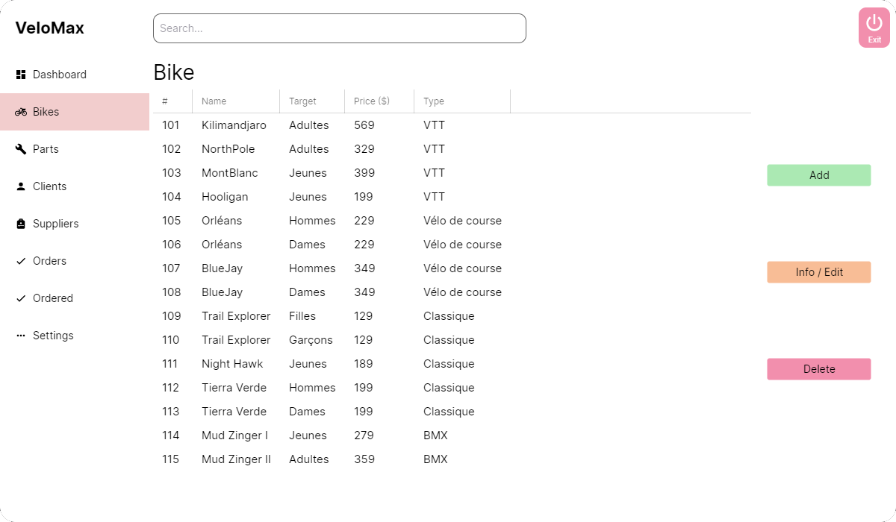
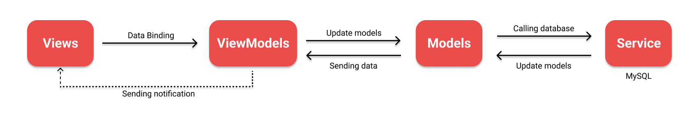

This post is still in building !

## Context

In the second semester of my first year in engineering we had database and interoperability course, for the evaluation we had to develop a CRUD application using C# and a MySQL database.
\
We were in a team of 3, all of us were mainly on a **linux** distribution so we could not use WPF, we chose instead Avalonia, a WPF alternative for cross-platform desktop app.

[Source code](https://github.com/nami10/VeloMax)

## Other preview

## MVVM design pattern

We had to implement the MVVM pattern since we were using Avalonia :

